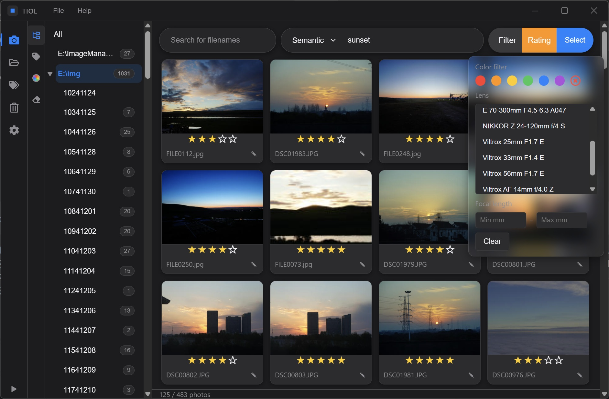

<!-- Language Switcher -->
English | [中文](README.zh.md)

[👉Official Site](https://tiol.netlify.app)

# TIOL — AI Local Photo Manager

Your privacy-first, local-first photo manager. Automatically tags photos. Built-in fast, intelligent searching. 

[](https://github.com/sclass53/TIOL-Image-Manager/releases)
[](https://www.gnu.org/licenses/gpl-3.0)
[](https://tiol.netlify.app/#download)



Supports **MacOS**, **Windows**, and **Linux**. 

All photos stay on your own hard drive. AI inference runs completely offline. No cloud services required.

## Features

- 🔍 **AI Powered Dual Search**: **Semantic search** (simply describe what you're looking for, e.g., *"a cup of coffee"*) + **Tag search** (fast)

- 📄 **Filter redundant images**: One-click organization of redundant and blurry/overexposed images.

- 💻 **Multiplatform support**: Supports Windows, MacOS, and Linux. Supports Nvidia CUDA, cpu, Apple CoreML，etc.

- ⚡ **Lightweight**: ~50MB in size，single exe and system onnx driver，provides portable editions。

- 📷 **Lens/Focal length filtering**: Filter the photos through specifying the lens/the focal length.

- 📁 **Directory Management**: Add/remove photo directories, file system monitoring (new/modified files are automatically queued for processing)

- 🏷️ **Custom Labels**: AI tagging – enter any labels (Chinese or English) in the Tags tab; files are indexed automatically on changes.

- 🖥️ **AI Engine Options**: auto / GPU / CPU / Apple CoreML (macOS native Neural Engine acceleration) – fully local

- 🔒 **Model Lockdown**: SHA256 checksum + resumable downloads + fallback to domestic mirrors, auto‑repair for corrupted models

## Installation

[Compiled Installers & Portable editions](https://github.com/sclass53/TIOL/releases)
[Official Website (With Compiled Releases)](https://tiol.netlify.app)

## Quick Start

```bash
# Dependencies: Rust 1.70+, tauri-cli 2.x (macOS also needs Xcode CLT; Windows needs VS Build Tools)
cargo tauri dev        # development mode
cargo tauri build      # production build (Windows → msi/nsis, macOS → .app/dmg)
```

On first launch, the AI model (~412 MB) will be downloaded automatically (mirror chain: hf‑mirror → openi → huggingface).  
**Before building/running on Windows**, copy `vendor/onnxruntime/win-x64/onnxruntime.dll` to the same directory as the executable.  
**On macOS**, you need a universal2 `onnxruntime.dylib` (official builds include CoreML EP) – see [BUILD.md](BUILD.md) for details.

## Data Locations

- Database / thumbnails:  
  Windows: `%APPDATA%\com.tiol.desktop`  
  macOS: `~/Library/Application Support/com.tiol.desktop`
- AI models:  
  Windows: `%LOCALAPPDATA%\com.tiol.desktop\models`  
  macOS: `~/Library/Caches/com.tiol.desktop/models`

## Contributing

This project is iterating quickly; issues and pull requests (as long as they are reasonable) are welcomed.

## Special Thanks

Thanks to [Ken709-mp4](https://github.com/Ken709-mp4) for providing image examples,patches, and ideas.

Thanks to [DiegoTang](https://github.com/DiegoTang) for providing image examples and ideas.

[👉Link To Their Site](https://mnfilm.netlify.app)
